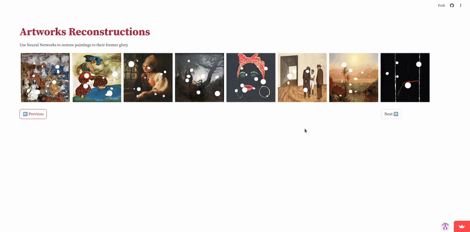
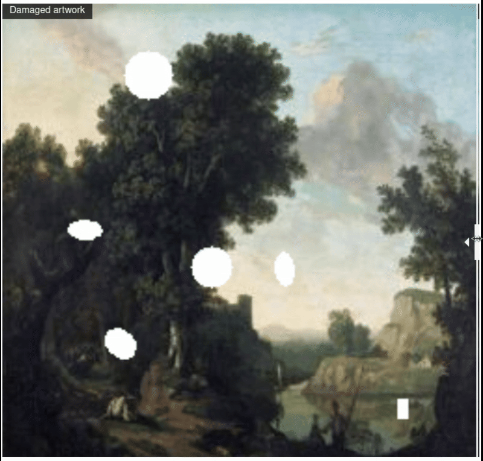
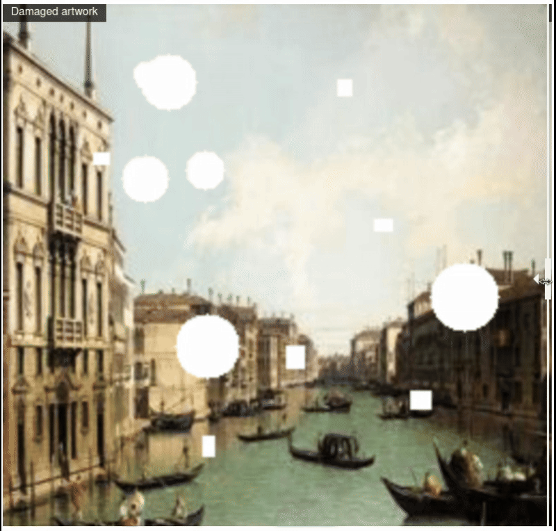
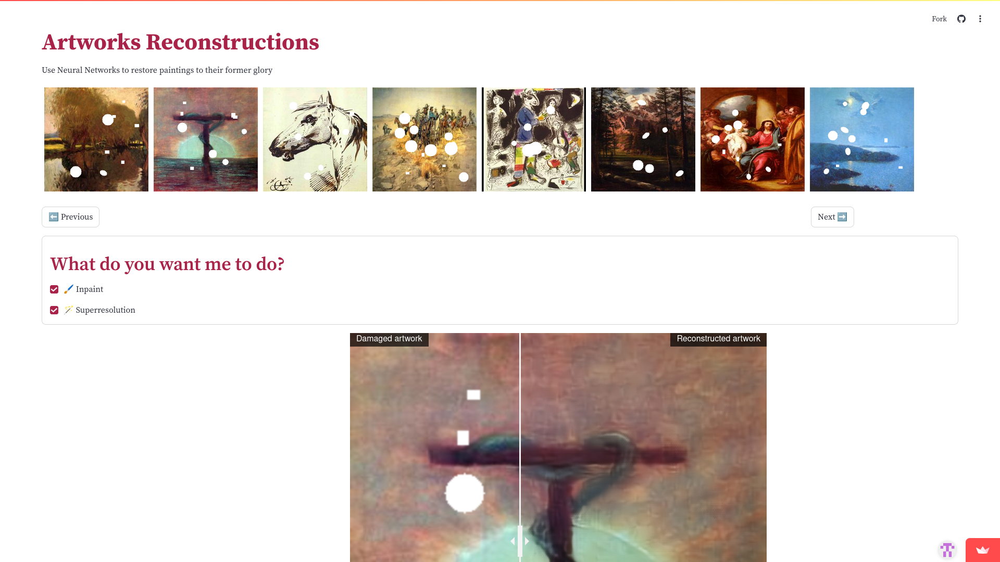

# Artworks Reconstruction



## What's This?

Our Artwork Reconstruction Page brings damaged artworks back to life using machine learning magic! This project aims to reconstruct damaged or incomplete artworks using unsupervised learning techniques. Check out the live demo to see it in action.

[🔗 View Live Demo](https://artworks-reconstruction.streamlit.app/)

## How It Works

1. **Image Classification**: A VQ-VAE network accurately classifies the input artwork. 
2. **Conditional Inpainting**: A GAN fills in missing parts, creating a seamless reconstruction. 
3. **Super-Resolution**: An autoencoder enhances the resolution, delivering crisp and detailed results.

<div align="center">
    
    
</div>

## Run It Locally

1. Clone the repo:
    ```shell
    git clone https://github.com/your-username/artwork-reconstruction.git
    cd artwork-reconstruction
    ```
2. Install dependencies:
    ```shell
    pip install -r requirements.txt
    ```
3. Launch the app:
    ```shell
    streamlit run app.py
    ```




---

## The Team
<a href="https://github.com/anekil">
  
</a>
<a href="https://github.com/Adrian-Rochminski">
  
</a>
<a href="https://github.com/Krizzuu">
  
</a>


## Acknowledgments
Special thanks to the WikiArt dataset and the open-source community for their contributions.

## License
This project is licensed under the MIT License. See the LICENSE file for details.
